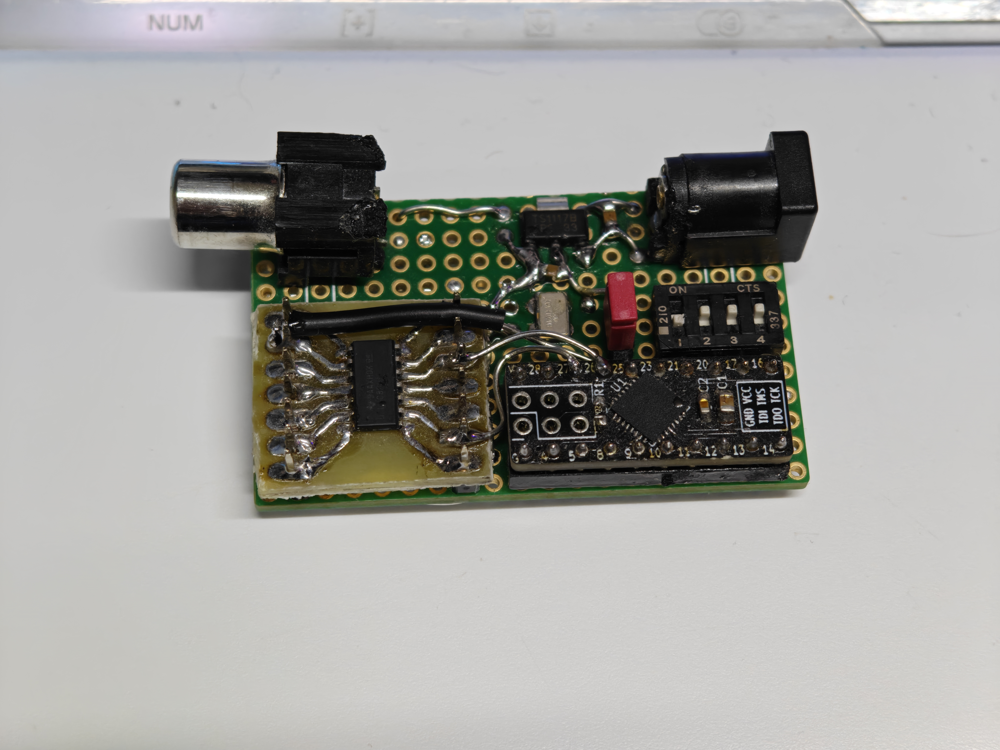
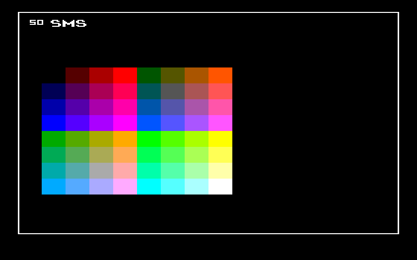

# Signal generator

A small device intended to generate various LumaCode signals. Its main purpose is for developing and
testing decoding/upscaling equipment.

## Usage

The device is powered by 5V over a barrel jack (center positive).
Use the jumper link to select a 50Hz (when jumper closed) or 60Hz (when jumper open) source. 
16 different patterns can be chosen by the 16 combinations of the dip switches.

## Signal possibilites 

The following switch combinations are supported:

1   |  2  | 3   |4    | Signal
--- | --- | --- | --- | -------------------------
OFF | OFF | OFF | OFF | C64/C128
OFF | OFF | OFF | ON  | C64 6567R56A (only 60Hz)
OFF | OFF | ON  | OFF | VIC 20 
OFF | OFF | ON  | ON  | C16, Plus/4
OFF | ON  | OFF | OFF | Atari 8-bit
OFF | ON  | OFF | ON  | Atari 2600 PAL colors
OFF | ON  | ON  | OFF | Atari 2600 NTSC colors
OFF | ON  | ON  | ON  | Atari 7800 
ON  | OFF | OFF | OFF | TMS99xxA
ON  | OFF | OFF | ON  | ZX Spectrum
ON  | OFF | ON  | OFF | NES
ON  | OFF | ON  | ON  | Sega Master System
ON  | ON  | OFF | OFF | Intellivision
ON  | ON  | OFF | ON  | G7000 or Odyssey II
ON  | ON  | ON  | OFF | MC
ON  | ON  | ON  | ON  | Lumacode 270p (only 50Hz)

The last option is not used in any actual hardware, but this is an experimental signal with a resolution 
of 480x270 and 6 bits color depth (same color encoding as the Master System). When upscaling by a 
factor of 4, this signal perfectly fits a full-HD screen. Maybe this could be
useful for some tinkering projects. 
